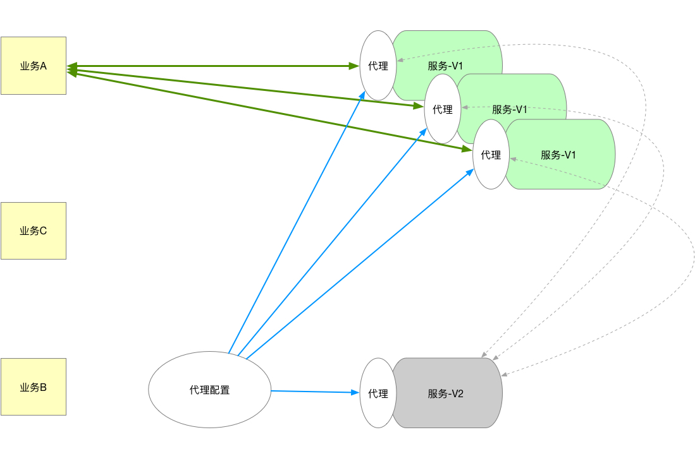

## 背景
当分布式调度架构中缺少统一的调度网关，各业务团队通过 Dubbo Client 直接将流量打到了服务端，而要业务团队配合服务端做灰度更是不现实的，所以重要版本的发布就是一件极其头大的事。

在这种情况下，我们就只能打服务端的主意，把一个个服务端变成一个个微型调度网关。从实践上来说，这是可行的。

## 方案
### 原则
 - 对应用服务透明
 
 不用入侵应用，无配置无开发无发版。很好理解：
 
 1、对开发的新版本来说无所谓，但是旧版本呢？
 
 2、代理对应用肯定是有一定性能影响的，灰度完成后（已摘除旧版本）如何无感知的摘除新版本的代理？
 
 
 - 能适配多种代理
 
 目前来说就 Duddo 服务的代理。因为 Rest 请求，走统一网关有更优雅的实现，例如：Nginx 。
 

### 设计
#### 总体设计

#### 代理设计

#### 代理实现

### 使用手册
[详见](doc/use.md)
